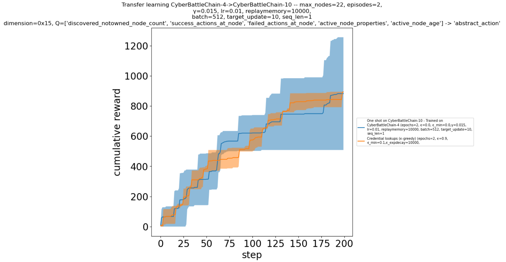
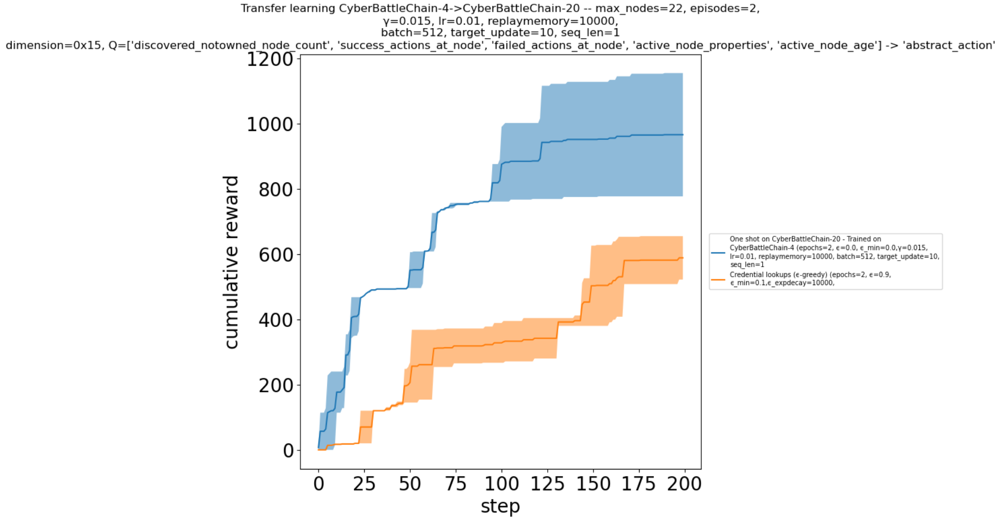
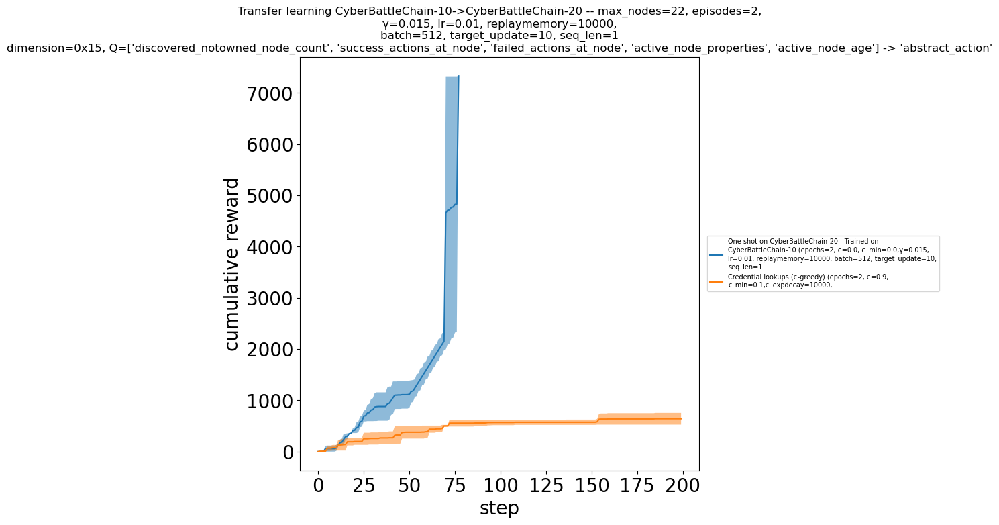

# Cybersecurity Red-Team Agent with Deep Reinforcement Learning

## 1. Problem Statement

## 2. Model Overview

## 3. Install & Setup

The instructions were tested on a Linux Ubuntu distribution (both native and via WSL).

If conda is not installed already, you need to install it by running the `install_conda.sh` script.

```bash
bash install-conda.sh
```

Once this is done, open a new terminal and run the initialization script:
```bash
bash init.sh
```
This will create a conda environmen named `cybersim` with all the required OS and python dependencies.

To activate the environment run:

```bash
conda activate cybersim
```

## 4. Run & Results

Running results are saved at /notebooks/output
Exploit step images are genearated. (Not gif)

### 4.1. Baseline
#### 4.1.1. Random

```bash
./notebooks/run_baseline_random.sh python3
```


#### 4.1.2. Rule-Based

```bash
./notebooks/run_baseline_rulebased.sh python3
```


#### 4.1.3. Tabular Q-Learning

```bash
./notebooks/run_baseline_tabularq.sh python3
```


#### 4.1.4. Deep Q-Learning

```bash
./notebooks/run_baseline_dql.sh python3
```


#### 4.1.5. Deep Recurrent Q-Learning

```bash
./notebooks/run_baseline_drql.sh python3
```


### 4.2. Transfer Learning:

#### 4.2.1. Deep Q-Learning

```bash
./notebooks/run_transfer_dql.sh python3
```


#### 4.2.2 Deep Recurrent Q-Learning

```bash
./notebooks/run_transfer_drql.sh python3
```





### 4.3. Toy CTF

Toy CTF Answer
```bash
./notebooks/run_toyctf_solved.sh python3
```


#### 4.3.1. Random

```bash
./notebooks/run_toyctf_random.sh python3
```


#### 4.3.2. Rule-Based

```bash
./notebooks/run_toyctf_rulebased.sh python3
```


#### 4.3.3. Tabular Q learning

```bash
./notebooks/run_toyctf_tabularq.sh python3
```


#### 4.3.4. Deep Q-Learning

```bash
./notebooks/run_toyctf_dql.sh python3
```

#### 4.3.5. Deep Recurrent Q-Learning

```bash
./notebooks/run_toyctf_drql.sh python3
```

### 4.4. Add Defender
#### 4.4.1. Tabular Q Learning
#### 4.4.2. DQL
#### 4.4.3. DRQN

## 5. Discussion