# Cybersecurity Red-Team Agent with Deep Reinforcement Learning
This project implements cybersecurity red-team (attacker) agents in Microsoft’s **CyberBattleSim** environment.
CyberBattleSim: https://github.com/microsoft/CyberBattleSim

Additional project documentation is available in `/doc`.

## 1. Problem Statement
Cybersecurity red teams perform penetration testing across diverse systems and network configurations. However, traditional playbooks and static rules often fail to generalize when the environment changes (e.g., topology, exposed services, vulnerabilities, firewall rules, and credential placement).
To address this, we model attacker behavior as a **sequential decision-making** problem:

- **Environment:** Enterprise-like network graph (nodes, services, vulnerabilities, credentials, firewall rules)
- **Observation:** Partial information revealed through scans, discovered credentials, and action outcomes
- **Action:** Discrete attacker actions (scan, exploit, authenticate, lateral movement, credential use, etc.)
- **Objective:** Maximize cumulative reward (e.g., privilege gain or reaching high-value nodes) while minimizing wasted steps (and optionally risk/cost)

This naturally fits an **MDP/POMDP** formulation and is well-suited for reinforcement learning.

---

## 2. Model Overview

This project trains and evaluates multiple attacker agents provided by CyberBattleSim.
In addition, it implements a **Deep Recurrent Q-Learning (DRQL/DRQN)** agent by extending the Deep Q-Learning approach with an **LSTM-based** memory module to better handle partial observability.

### 2.1 Attacker Agents
- **Random:** Samples valid actions uniformly as a sanity-check baseline.
- **Rule-Based (CredentialCacheExploiter):** A lightweight baseline that prioritizes exploiting the **credential cache**. It generates an action using cached credentials; if the action is invalid or undefined, it falls back to random exploration.
- **Tabular Q-Learning:** Learns a discrete Q-table over a handcrafted state representation (effective in small or simpler settings).
- **Deep Q-Learning (DQL / DQN):** Uses a neural network to approximate \(Q(s,a)\), enabling learning in larger state spaces.
- **Deep Recurrent Q-Learning (DRQL / DRQN):** Extends DQL with recurrence (LSTM) to maintain a history-dependent hidden state, which can help when observations are partial or delayed.

### 2.2 Training / Evaluation
- **Training:** Uses epsilon-greedy exploration. DQL/DRQL are trained with experience replay and periodic target-network updates.
- **Evaluation:** Runs the learned policy with reduced exploration to measure reward, episode length, and overall attack effectiveness.

### 2.3 Environments
- **CyberBattleChain-v0:** Linear/chain-like topology for controlled benchmarking and transfer-learning experiments.
- **CyberBattleToyCtf-v0:** Small CTF-style environment with multiple services, vulnerabilities, and credential paths.

### 2.4. Defender Agents
- **ScanAndReimageCompromisedMachines:** Periodically scans a random subset of nodes and detects an attacker with a fixed probability when the attacker is present. If detected and the node is reimageable, it reimages the compromised machine to remove the attacker’s foothold.

- **ExternalRandomEvents:** Randomly perturbs the environment by patching or planting vulnerabilities, stopping services, and adding/removing firewall rules. This introduces non-stationarity, making attacker policies harder to reuse and stability harder to maintain.

---

## 3. Setup

### 3.1. Install
The instructions were tested on a Linux Ubuntu distribution (both native and via WSL).

If conda is not installed already, you need to install it by running the `install_conda.sh` script.

```bash
bash install-conda.sh
```

Once this is done, open a new terminal and run the initialization script:
```bash
bash init.sh
```
This will create a conda environmen named `cybersim` with all the required OS and python dependencies.

To activate the environment run:

```bash
conda activate cybersim
```

### 3.2. Repository Structure

```text
.
├── README.md
├── LICENSE
├── env.yml
├── requirements.txt
├── install-conda.sh
├── init.sh
├── doc/                      # Additional project notes and documentation
├── figures/                  # Exported result figures (GIF/PNG) referenced in README
├── notebooks/                # Runnable experiment notebooks (Python scripts via jupytext/papermill)
│   ├── notebook_benchmark.py # Benchmark entry point (shared evaluation pipeline)
│   ├── baseline_*.py         # Chain environment: Random / Rule-based / TabularQ / DQL / DRQL
│   ├── transfer_*.py         # Transfer learning experiments (Chain sizes)
│   ├── toyctf_*.py           # ToyCTF experiments
│   ├── defender_*.py         # Experiments with a defender (Blue team)
│   ├── run_*.sh              # Convenience runners (papermill execution + output export)
│   └── output/               # Generated run artifacts (executed notebooks, logs, plots)
└── cyberbattle/
    ├── _env/                 # Gymnasium environments + wrappers (where the "game" meets RL)
    ├── agents/               # Agent implementations (random/baselines + DQL/DRQL policies and wrappers)
    ├── simulation/           # Core simulator: network model, actions, outcomes, graph generation
    └── samples/              # Example scenarios/topologies used by the simulator (toy/chain/etc.)
```

---

## 4. Experiments & Results

All run artifacts (executed notebooks, logs, plots) are saved under `notebooks/output/`.
Figures referenced below are exported under `figures/`.

### 4.1. Experiment 1 — Baseline Attacker Training & Evaluation (Chain Network)
Train and evaluate attacker agents on `CyberBattleChain-v0`. Each result GIF shows the evaluation phase, where the agent exploits the network.

#### 4.1.1. Random

```bash
./notebooks/run_baseline_random.sh python3
```
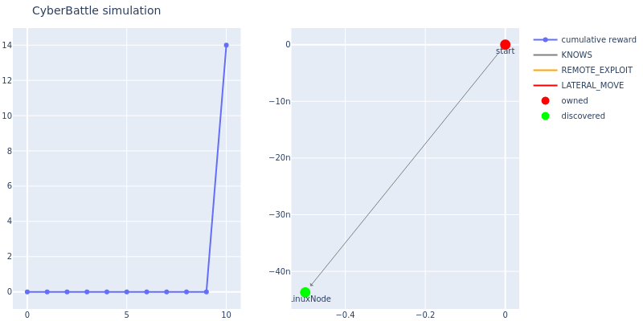

#### 4.1.2. Rule-Based

```bash
./notebooks/run_baseline_rulebased.sh python3
```

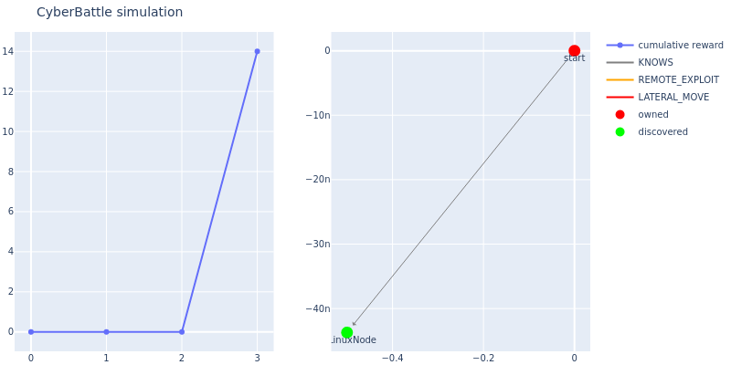

#### 4.1.3. Tabular Q-Learning

```bash
./notebooks/run_baseline_tabularq.sh python3
```

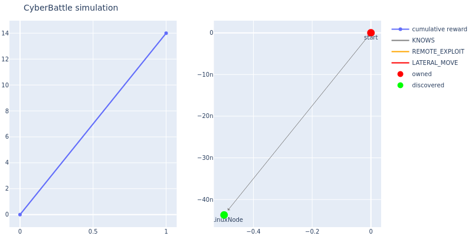

#### 4.1.4. Deep Q-Learning

```bash
./notebooks/run_baseline_dql.sh python3
```

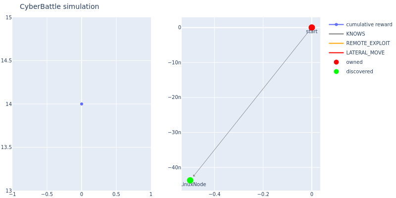

#### 4.1.5. Deep Recurrent Q-Learning

```bash
./notebooks/run_baseline_drql.sh python3
```


### 4.2. Experiment 2 — Transfer Learning Evaluation (Q-Learning on Chain)
Evaluate how well a policy trained on a smaller Chain generalizes to larger Chains.
- Train on: Chain-{N_train}
- Evaluate on: Chain-{N_test} (one-shot / few-shot)

#### 4.2.1. Deep Q-Learning

```bash
./notebooks/run_transfer_dql.sh python3
```

- Train on 4 chain and Evaulate on 10 chain
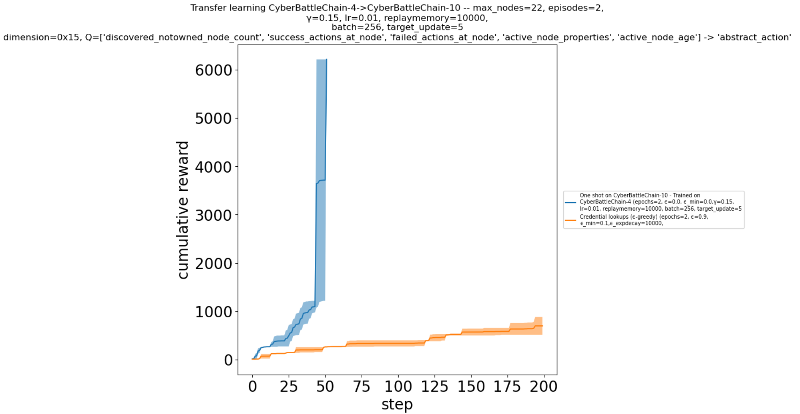

- Train on 4 chain and Evaulate on 20 chain
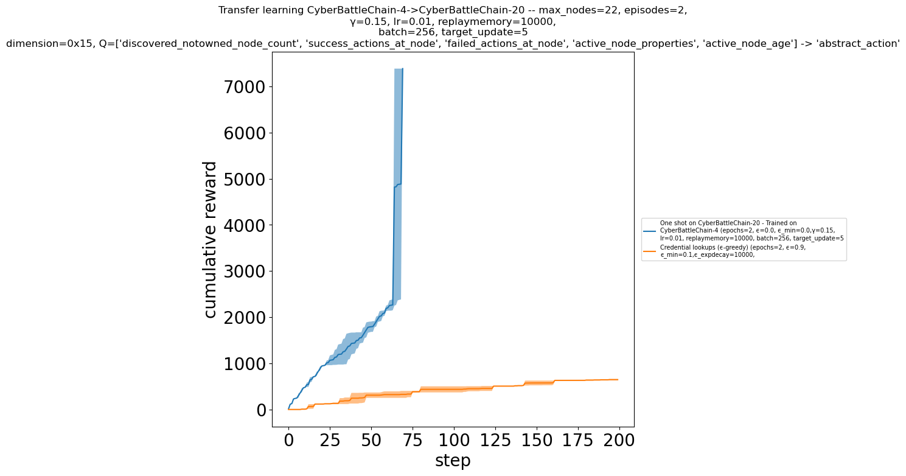

- Train on 10 chain and Evaulate on 20 chain
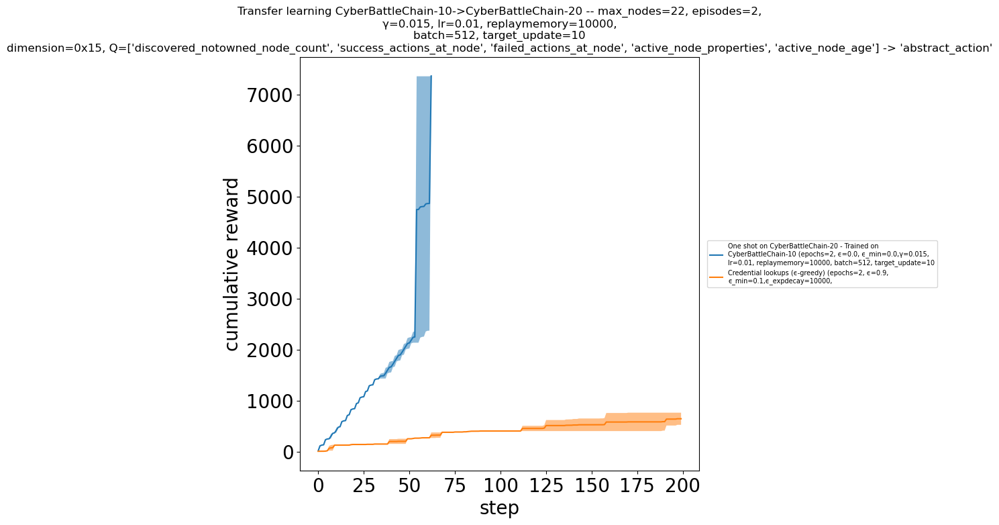

#### 4.2.2 Deep Recurrent Q-Learning

```bash
./notebooks/run_transfer_drql.sh python3
```

- Train on 4 chain and Evaulate on 10 chain
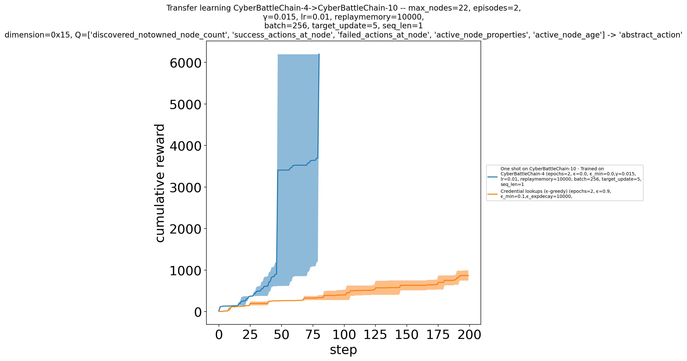

- Train on 4 chain and Evaulate on 20 chain
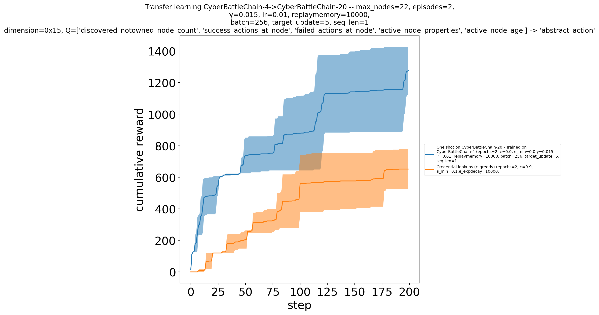

- Train on 10 chain and Evaulate on 20 chain
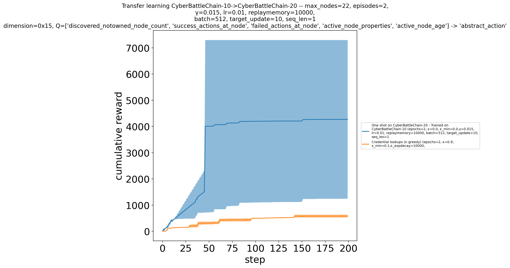

### 4.3. Experiment 3 — Toy CTF Evaluation (Attacker Agents)
Evaluate attacker agents on `CyberBattleToyCtf-v0`. A reference/solution-style run to validate the environment and expected path.

- (Optional) Toy CTF Answer
```bash
./notebooks/run_toyctf_solved.sh python3
```

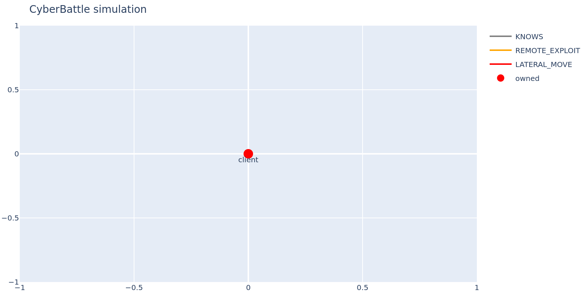

#### 4.3.1. Random

```bash
./notebooks/run_toyctf_random.sh python3
```


#### 4.3.2. Rule-Based

```bash
./notebooks/run_toyctf_rulebased.sh python3
```

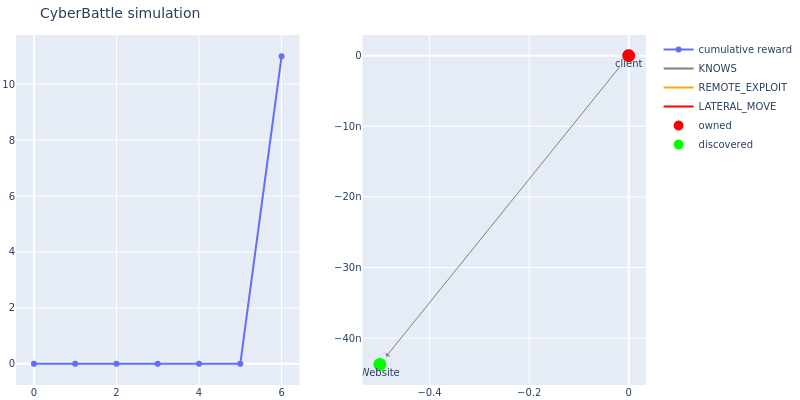

#### 4.3.3. Tabular Q-Learning

```bash
./notebooks/run_toyctf_tabularq.sh python3
```

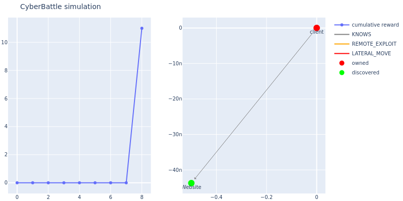

#### 4.3.4. Deep Q-Learning

```bash
./notebooks/run_toyctf_dql.sh python3
```

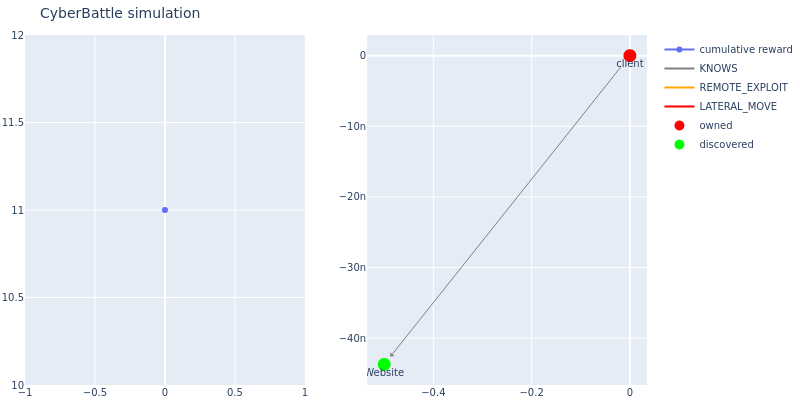

#### 4.3.5. Deep Recurrent Q-Learning

```bash
./notebooks/run_toyctf_drql.sh python3
```


### 4.4. Experiment 4 — Adding a Defender (Blue Team) and Re-evaluating
Introduce a defender and measure robustness / performance degradation of attacker agents.

#### 4.4.1. Deep Q-Learning

```bash
./notebooks/run_defender_rulebased.sh python3
```

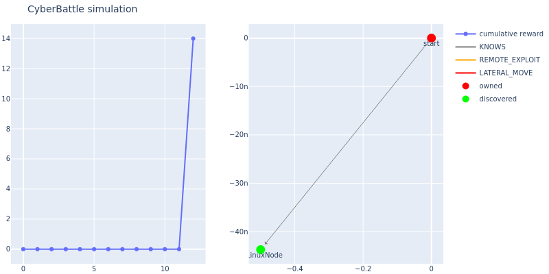

#### 4.4.2. Deep Q-Learning

```bash
./notebooks/run_defender_dql.sh python3
```


#### 4.4.3. Deep Recurrent Q-Learning

```bash
./notebooks/run_defender_drql.sh python3
```


---

## 5. Discussion
### 5.1. Result Summary & Analysis

---

#### 5.1.1. Experiment 1 — Baseline Attacker Training & Evaluation (Chain Network)

| Agent | Nodes Found | Nodes Exploited |
|---:|:---:|:---:|
| Random | 3 / 11 | 2 / 11 |
| Rule-Based | 5 / 11 | 5 / 11 |
| Tabular Q-Learning | 5 / 11 | 5 / 11 |
| Deep Q-Learning (DQN) | 11 / 11 | 11 / 11 |
| Deep Recurrent Q-Learning (DRQN) | 11 / 11 | 11 / 11 |

In the Chain network, both DQN and DRQN achieve perfect final coverage (11/11) for discovery and exploitation. This suggests that
- (1) the environment is relatively simple,
- (2) the observation design provides sufficient information for planning,
- (3) the optimal behavior can be learned without needing long-term memory.

In this process, maintaining a compact memory of “what has been observed/attempted so far” matters even when the final goal is achievable by both methods.

DRQN explicitly models temporal context through its recurrent hidden state, which helps the agent keep track of intermediate progress signals such as previously scanned services, discovered credentials, and recently successful/failed exploits. This reduces redundant actions (e.g., repeated scans or repeated failed exploits) and encourages the agent to proceed deeper along the attack chain.

As a result, DRQN tends to execute a broader and more consistent sequence of remote → pivot → local steps, which is reflected as “more remote/local attacks found,” even if the final node coverage is identical.

---

#### 5.1.2. Experiment 2 — Transfer Learning Evaluation (Q-Learning on Chain)

**Deep Q-Learning (DQN)**

| Train Size | Eval Size | Transfer |
|---:|---:|:---:|
| 4 | 10 | Success |
| 4 | 20 | Success |
| 10 | 20 | Success |

DQN transfers successfully across all tested settings, which implies that the learned policy scales with environment size (at least for the tested Chain family) and that the learned features correlate with generalizable attack progress (e.g., privilege level, reachable services, credential discovery patterns).

**Deep Recurrent Q-Learning (DRQN)**

| Train Size | Eval Size | Transfer |
|---:|---:|:---:|
| 4 | 10 | Success |
| 4 | 20 | Fail |
| 10 | 20 | Success |

In contrast, DRQN shows an unstable transfer outcome (Fail on 4→20 but Success on 10→20). This failure pattern is often consistent with training instability in recurrent off-policy RL, rather than indicating a fundamental limitation of recurrence itself.

Concretely, DRQN transfer can fail when:
- **Seq_len is insufficient** to capture relevant dependencies (or too long, causing optimization instability).
- **Overfitting to small-size dynamics** occurs in training (train size 4) such that memory learns spurious patterns that do not hold for larger sizes (eval size 20).

When evaluated on a much larger environment (size 20), the attack requires longer multi-step dependencies (more pivots, more opportunities for dead-ends, more delayed reward). In that regime, DRQN’s behavior can change noticeably depending on whether its learned memory dynamics align with the longer trajectories.

Training on a moderately larger setting (size 10) increases trajectory diversity and length, which can better match the evaluation distribution, explaining why 10→20 transfers successfully while 4→20 may fail.

---

#### 5.1.3. Experiment 3 — Toy CTF Evaluation (Attacker Agents)

| Agent | Nodes Found | Nodes Exploited |
|---:|:---:|:---:|
| Answer (Oracle) | 9 / 9 | 5 / 5 |
| Random | 3 / 9 | 1 / 5 |
| Rule-Based | 5 / 9 | 1 / 5 |
| Tabular Q-Learning | 5 / 9 | 1 / 5 |
| Deep Q-Learning (DQN) | 9 / 9 | 5 / 5 |
| Deep Recurrent Q-Learning (DRQN) | 9 / 9 | 5 / 5 |

In the Toy CTF environment, both DQN and DRQN achieve full success (9/9 discovery and 5/5 exploitation), but DRQN can reach “exploit all nodes” faster because Toy CTF more strongly reflects partial observability and delayed consequences than the Chain setting.

The attacker must repeatedly alternate between information-gathering actions (e.g., scanning), prerequisite collection (e.g., credentials), and multi-hop pivot decisions before the final exploitation path becomes available. This produces longer dependency chains where the utility of an action often depends on what happened several steps earlier.

DRQN’s recurrent hidden state serves as a compact memory of recent outcomes (e.g., which services were already scanned, which credentials were discovered, which branch of the network was already explored). This helps the agent avoid redundant loops and prioritize the next actionable pivot, especially when the observation does not explicitly encode the complete history.

As a result, DRQN tends to converge to more consistent attack sequences (scan → credential → remote exploit → pivot → local escalation) and reaches the final exploitation set in fewer steps, even when both methods eventually achieve the same end-state coverage.

---

#### 5.1.4. Experiment 4 — Adding a Defender (Blue Team) and Re-evaluating

| Agent | Nodes Found | Nodes Exploited |
|---:|:---:|:---:|
| Rule-Based | 4 / 11 | 3 / 11 |
| Deep Q-Learning (DQN) | 11 / 11 | 7 / 11 |
| Deep Recurrent Q-Learning (DRQN) | 11 / 11 | 11 / 11 |

---

### 5.2. Future Work

1) **Move to continuous-time / continuous-control settings**
Policies should be evaluated in a continuous or event-driven environment (e.g., C-CyberBattleSim-style) that models action duration, delayed effects, and risk accumulation over time. This enables optimizing **time-to-compromise**, **cumulative detection risk**, and **operational cost**, and supports algorithms such as PPO/SAC/TD3. (Refer /notebooks/stable-baselines-agent.py)

2) **Attacker–defender co-evolution (multi-agent learning)**
An active defender (isolation, reimaging, patching, deception) should be introduced to measure attacker performance under defense pressure. Joint training/self-play can then be explored to improve robustness against adaptive opponents.

3) **Hierarchical decision-making**
The task can be decomposed into high-level planning (stage/target selection) and low-level execution (scan/exploit/credential use). This structure is expected to improve transfer to new network structures and make strategies easier to interpret.

4) **More realistic observations + memory models**
Observations should be shifted toward operational signals (logs/alerts/scan records), and recurrent or Transformer-based history encoders should be evaluated under partial observability. The goal is to reduce redundant actions and accelerate pivots.

5) **Generalization across topology changes**
Beyond size scaling, training and evaluation should vary topology, services, vulnerability placement, and credential distribution, and then test on unseen structures.

6) **Security-oriented objectives and reporting**
Stealth/cost-aware rewards and reporting should be added, including success-rate, steps/time-to-goal, and d
::contentReference[oaicite:0]{index=0}
